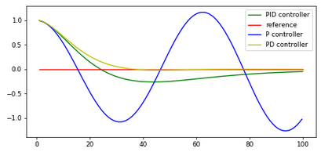

# CarND-Controls-PID
Self-Driving Car Engineer Nanodegree Program

## Method

A PID controller is a commonly used method of controlling dynamic systems throughout industry. The PID stands for Proportional, Derivative and Integral control and was first mathematically formalised by [Nicolas Minorsky](http://ieeecss.org/CSM/library/1984/nov1984/w10-15.pdf). Nicolas was workin as an Engineer for the American Navy and tasked with observing Helmsmen steering ships such that a method of automatically steering ships could be developed.

### Proportional Control
Proportional control has been used since long before Nicolas turned up on the scene. Infact it had even been used to automatically steer small ships.

Propotional control is the idea that the larger the error is in a system the larger the corrective action is that is applied to the system. This is a very powerful and intuative technique. However a purely proportional control system is prone to overshoot, that is the system will overcompensate for the measured error and induce an opposite error. This is shown by the green signal oscillating around the red in the image below.


### Derivative Control

The problem with pure proportional control is that it only works on the current system state, that is it can't accomodate the fact that as a controller gets closer to the set point it should reduce the amount by which it modulates the process. This was noted by Nicolas Minorsky as the observation that a helmsman starts to decrease the amount by which he corrects the steering error the closer they get to the correct heading. This is mathematically formalised by including a derivative correction factor.


### Integral Control



##Tuning a PID controller

###Zeigler Nicholas Method

###Twiddle


## Dependencies

* cmake >= 3.5
 * All OSes: [click here for installation instructions](https://cmake.org/install/)
* make >= 4.1(mac, linux), 3.81(Windows)
  * Linux: make is installed by default on most Linux distros
  * Mac: [install Xcode command line tools to get make](https://developer.apple.com/xcode/features/)
  * Windows: [Click here for installation instructions](http://gnuwin32.sourceforge.net/packages/make.htm)
* gcc/g++ >= 5.4
  * Linux: gcc / g++ is installed by default on most Linux distros
  * Mac: same deal as make - [install Xcode command line tools]((https://developer.apple.com/xcode/features/)
  * Windows: recommend using [MinGW](http://www.mingw.org/)
* [uWebSockets](https://github.com/uWebSockets/uWebSockets)
  * Run either `./install-mac.sh` or `./install-ubuntu.sh`.
  * If you install from source, checkout to commit `e94b6e1`, i.e.
    ```
    git clone https://github.com/uWebSockets/uWebSockets 
    cd uWebSockets
    git checkout e94b6e1
    ```
    Some function signatures have changed in v0.14.x. See [this PR](https://github.com/udacity/CarND-MPC-Project/pull/3) for more details.
* Simulator. You can download these from the [project intro page](https://github.com/udacity/self-driving-car-sim/releases) in the classroom.

There's an experimental patch for windows in this [PR](https://github.com/udacity/CarND-PID-Control-Project/pull/3)

## Basic Build Instructions

1. Clone this repo.
2. Make a build directory: `mkdir build && cd build`
3. Compile: `cmake .. && make`
4. Run it: `./pid`. 

Tips for setting up your environment can be found [here](https://classroom.udacity.com/nanodegrees/nd013/parts/40f38239-66b6-46ec-ae68-03afd8a601c8/modules/0949fca6-b379-42af-a919-ee50aa304e6a/lessons/f758c44c-5e40-4e01-93b5-1a82aa4e044f/concepts/23d376c7-0195-4276-bdf0-e02f1f3c665d)

## Editor Settings

We've purposefully kept editor configuration files out of this repo in order to
keep it as simple and environment agnostic as possible. However, we recommend
using the following settings:

* indent using spaces
* set tab width to 2 spaces (keeps the matrices in source code aligned)

## Code Style

Please (do your best to) stick to [Google's C++ style guide](https://google.github.io/styleguide/cppguide.html).

## Project Instructions and Rubric

Note: regardless of the changes you make, your project must be buildable using
cmake and make!

More information is only accessible by people who are already enrolled in Term 2
of CarND. If you are enrolled, see [the project page](https://classroom.udacity.com/nanodegrees/nd013/parts/40f38239-66b6-46ec-ae68-03afd8a601c8/modules/f1820894-8322-4bb3-81aa-b26b3c6dcbaf/lessons/e8235395-22dd-4b87-88e0-d108c5e5bbf4/concepts/6a4d8d42-6a04-4aa6-b284-1697c0fd6562)
for instructions and the project rubric.

## 